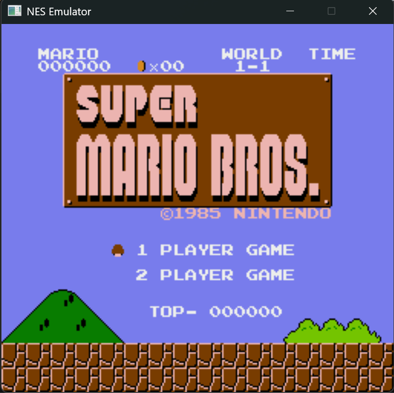

### NES Emulator (in C++)

- ✅ Added All 151 official opcodes with instructions.
- ✅ Added Cartridge and Mapper000 support.
- ✅ Added nestest to verify all 151 opcodes are working correctly.
- ✅ Added PPU registers.
- ✅ Added an SDL3 window and app loop.
- ✅ Added PPU background rendering and scrolling.
- ✅ Added controls.
- ✅ Added PPU sprite rendering.
- 🚀 First playable build!
  - Compatible with most [Mapper000](https://nesdir.github.io/mapper0.html) ROMs (including Super Mario Bros.).
- TODO: Add APU.
- TODO: Add Mapper001 support.
- TODO: Update README build instructions.
- TODO: Improve performance.

<p style="text-align: center;">
  
</p>

### Building and Running

Rendering uses SDL3, installed via [vcpkg](https://github.com/microsoft/vcpkg).

**Prerequisites**
- A C++23 compiler:
  - Windows: MSVC / Visual Studio Build Tools with the "Desktop development with C++" workload
  - macOS: Xcode Command Line Tools (`xcode-select --install`), Xcode 16+ for full C++23 support
- CMake and Ninja
  - macOS: `brew install cmake ninja`
  - Windows PowerShell: `winget install -e --id Ninja-build.Ninja` and `winget install cmake`
- [vcpkg](https://github.com/microsoft/vcpkg), cloned and bootstrapped:
  ```
  git clone https://github.com/microsoft/vcpkg
  ./vcpkg/bootstrap-vcpkg.bat   # bootstrap-vcpkg.sh on Linux/macOS
  ```
- The `VCPKG_ROOT` environment variable set to that clone's path

SDL3 itself does **not** need to be installed manually — it's declared in `vcpkg.json` and vcpkg installs it automatically on first configure.

On Windows, run these from a "Developer Command Prompt/PowerShell for VS" (or after running `vcvars64.bat`) so `cl.exe` and `ninja` are on `PATH`. On macOS, a normal terminal is fine as long as the Command Line Tools are installed.

Configure Build dir: `cmake --preset default` \
Build app target: `cmake --build cmake-build-debug --target nes_emulator_cpp` \
Run Emulator: `./cmake-build-debug/nes_emulator_cpp <rom_path>` (e.g. `./cmake-build-debug/nes_emulator_cpp tests/roms/nestest.nes`)

### Testing

Using `doctest.h`.

Build tests only: `cmake --build cmake-build-debug --target nes_emulator_tests` \
Build and run tests: `cmake --build cmake-build-debug --target run_tests`

### Resources

- [Building Your First Emulator by Matias Salles](https://leanpub.com/nes-emulator-en)
- [Writing NES Emulator in Rust by Rafael Bagmanov](https://bugzmanov.github.io/nes_ebook/chapter_1.html)
- [OneLoneCoder/olcNES - GitHub](https://github.com/OneLoneCoder/olcNES)
- [6502 Instruction Reference](https://www.nesdev.org/obelisk-6502-guide/reference.html?__cf_chl_f_tk=z6uyc9XSsj2aWhSthPoDHP6SSNSXVHT0jTnPmVBZycc-1783039093-1.0.1.1-Rxg3fg7plNMeW95x2ZbAMl43kuHGWjQSOfGkQ1jImAA)
- [NMOS 6502 Opcodes by John Pickens](https://6502.org/tutorials/6502opcodes.html)
- [PPU Registers - NesDev Wiki](https://www.nesdev.org/wiki/PPU_registers)
- [CSEE 4840 Embedded System Design NES Emulator](https://www.cs.columbia.edu/~sedwards/classes/2020/4840-spring/reports/nes.pdf)
