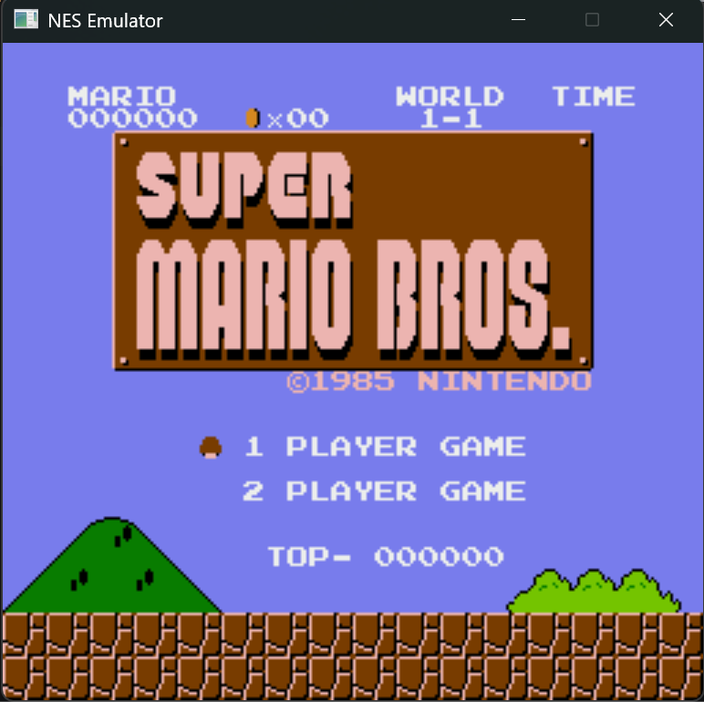

### NES Emulator (in C++)

[](https://github.com/StevenH34/nes-emulator-cpp/actions/workflows/ci.yml)

▶️ **[Play in your browser](https://stevenh34.github.io/nes-emulator-cpp/)**. Load your own `.nes` ROM with the file
picker or by dragging it onto the page.

- ✅ Added All 151 official opcodes with instructions.
    - TODO: add unofficial opcodes.
- ✅ Added Cartridge and Mapper000 support.
    - TODO: Add Mapper001 support.
- ✅ Added nestest to verify all 151 opcodes are working correctly.
- ✅ Added PPU registers.
- ✅ Added an SDL3 window and app loop.
- ✅ Added PPU background rendering and scrolling.
- ✅ Added controls.
- ✅ Added PPU sprite rendering.
- 🚀 First playable build!
    - Compatible with most [Mapper000](https://nesdir.github.io/mapper0.html) ROMs (including Super Mario Bros.).
- ✅ Add APU (Pulse, Triangle, and Noise channels).
    - TODO: Add DMC channel.
- ✅ Add save states.
- ✅ Added a WebAssembly build, deployed to [GitHub Pages](https://stevenh34.github.io/nes-emulator-cpp/).
- ✅ Added Python bindings (`nes_py`) — groundwork for AI agent training.
- ✅ Added a desktop menu bar ([Dear ImGui](https://github.com/ocornut/imgui)) with a resizable window that scales to the
  display.

<p style="text-align: center;">
  
</p>

### Controls

| NES Button | Keyboard         |
|------------|------------------|
| A          | Z                |
| B          | X                |
| Select     | Left/Right Shift |
| Start      | Enter            |
| Up         | Up Arrow         |
| Down       | Down Arrow       |
| Left       | Left Arrow       |
| Right      | Right Arrow      |
| Save State | F5               |
| Load State | F9               |

The desktop app also has keyboard shortcuts for its menus:

| Action   | Keyboard |
|----------|----------|
| Open ROM | Ctrl+O   |
| Reset    | Ctrl+R   |
| Exit     | Esc      |

The browser version uses the same NES controls; save states, the menus and their shortcuts are desktop-only.

### Desktop Menus

- **File**: Open ROM… (`.nes` file picker), Reset (restarts the current ROM from power-on), Exit
- **State**: Save State / Load State, stored as `<rom_path>.state` next to the ROM

The window opens at a size that suits your display scaling and can be resized; the picture keeps the NES aspect ratio
and stays pixel-sharp.

### Building and Running

Rendering uses SDL3 and the menus use Dear ImGui, both installed via [vcpkg](https://github.com/microsoft/vcpkg).

**Prerequisites**

- A C++23 compiler:
    - Windows: Visual Studio Build Tools with the "Desktop development with C++" workload and the
      "C++ Clang tools for Windows" component
    - macOS: Xcode Command Line Tools (`xcode-select --install`), Xcode 16+ for full C++23 support
- CMake and Ninja
    - macOS: `brew install cmake ninja`
    - Windows PowerShell: `winget install -e --id Ninja-build.Ninja` and `winget install cmake`
- [vcpkg](https://github.com/microsoft/vcpkg), cloned and bootstrapped:
  ```
  git clone https://github.com/microsoft/vcpkg
  ./vcpkg/bootstrap-vcpkg.bat   # bootstrap-vcpkg.sh on Linux/macOS
  ```
- The `VCPKG_ROOT` environment variable set to that clone's path

SDL3 and Dear ImGui do **not** need to be installed manually — they're declared in `vcpkg.json` and vcpkg installs
them automatically on first configure.

Configure and build in one step: `cmake --workflow --preset default` \
Run Emulator: `./build-debug/nes_emulator [rom_path]`

The ROM path is optional; without it the emulator opens empty and you can pick a ROM from **File > Open ROM**.

For an optimized Release build, use the `release` preset instead:

Configure and build in one step: `cmake --workflow --preset release` \
Run Emulator: `./build-release/nes_emulator [rom_path]`

**Windows note:** if `clang++` isn't on your `PATH`, run CMake from a shell set up by Visual Studio's `vcvars64.bat`.
That script points `VCPKG_ROOT` at Visual Studio's bundled vcpkg, so set it back to your own clone afterwards:

```
cmd /c "\"C:\Program Files (x86)\Microsoft Visual Studio\18\BuildTools\VC\Auxiliary\Build\vcvars64.bat\" && set VCPKG_ROOT=C:\vcpkg&& cmake --workflow --preset default"
```

### Building for WebAssembly

The browser build uses [Emscripten](https://emscripten.org/) and its own SDL3 port, so vcpkg isn't needed.

**Prerequisites**

- CMake and Ninja
- [emsdk](https://github.com/emscripten-core/emsdk), with Emscripten 6.0.5 (the version CI uses) installed and
  activated:
  ```
  git clone https://github.com/emscripten-core/emsdk
  cd emsdk
  ./emsdk install 6.0.5
  ./emsdk activate 6.0.5
  ```
- The `EMSDK` environment variable set to that clone's path (`emsdk_env.bat` / `source ./emsdk_env.sh` sets it for the
  current shell)

Configure and build in one step: `cmake --workflow --preset wasm` \
Serve it: `python -m http.server -d build-wasm/web`, then open http://localhost:8000

The page has to be served over HTTP; opening `index.html` directly from disk won't load the `.wasm`.

Pushes to `master` that pass CI are deployed to GitHub Pages automatically.

### Python Bindings

The `nes_py` module exposes the emulator core to Python via [nanobind](https://github.com/wjakob/nanobind),
built with [scikit-build-core](https://github.com/scikit-build/scikit-build-core).

**Prerequisites**

- Python 3.14+
- A C++23 compiler, CMake, Ninja (as above).

Build and install (re-run after C++ changes): `python -m pip install -e ".[test]"`

```python
import nes_py

core = nes_py.NesCore("roms/smb.nes")
core.step(nes_py.BUTTON_RIGHT | nes_py.BUTTON_A, frames=4)
obs = core.obs84()  # (84, 84) uint8 grayscale
state = core.save_state()  # same format as F5 save files
core.load_state(state)
```

For IDE code insight on `src/python/Bindings.cpp`, use the `python` CMake preset (`build-python/`).

### Testing

Using `doctest.h`.

Build tests only: `cmake --build build-debug --target nes_emulator_tests` \
Build and run tests: `cmake --build build-debug --target run_tests`

The tests also run as WebAssembly under Node (CI does this on every push): \
`cmake --build build-wasm --target nes_emulator_tests` then `node build-wasm/nes_emulator_tests.js`

Python binding tests (pytest, run in CI): `python -m pytest`

### Resources

- [Building Your First Emulator by Matias Salles](https://leanpub.com/nes-emulator-en)
- [Writing NES Emulator in Rust by Rafael Bagmanov](https://bugzmanov.github.io/nes_ebook/chapter_1.html)
- [OneLoneCoder/olcNES - GitHub](https://github.com/OneLoneCoder/olcNES)
- [6502 Instruction Reference](https://www.nesdev.org/obelisk-6502-guide/reference.html?__cf_chl_f_tk=z6uyc9XSsj2aWhSthPoDHP6SSNSXVHT0jTnPmVBZycc-1783039093-1.0.1.1-Rxg3fg7plNMeW95x2ZbAMl43kuHGWjQSOfGkQ1jImAA)
- [NMOS 6502 Opcodes by John Pickens](https://6502.org/tutorials/6502opcodes.html)
- [PPU Registers - NesDev Wiki](https://www.nesdev.org/wiki/PPU_registers)
- [CSEE 4840 Embedded System Design NES Emulator](https://www.cs.columbia.edu/~sedwards/classes/2020/4840-spring/reports/nes.pdf)
